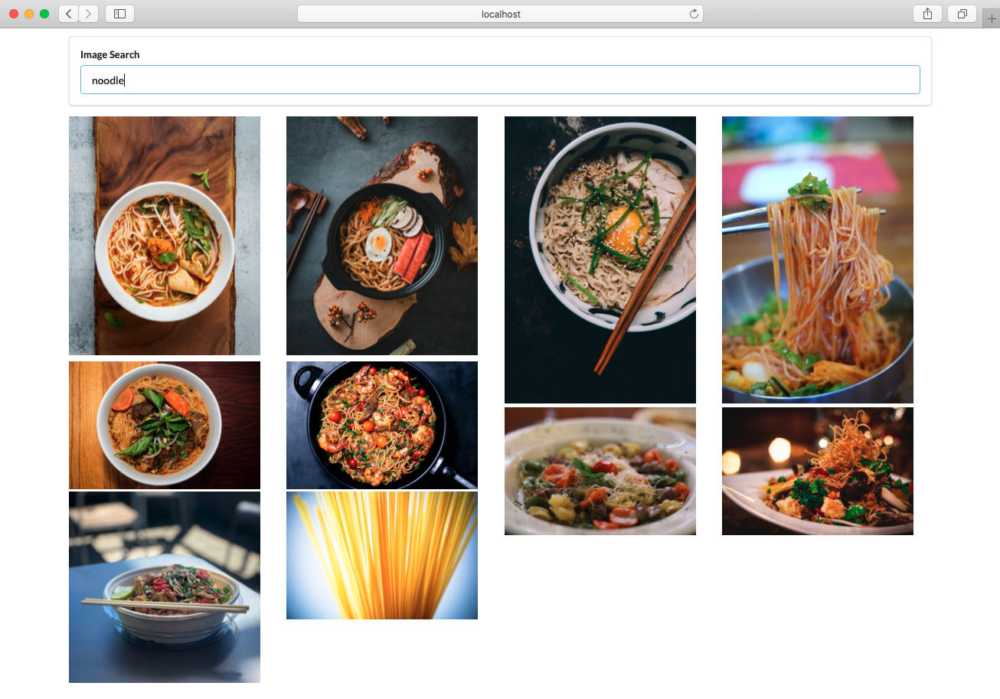

# picture-search
This is a web application for picture search

<br/>

## Screenshot


<br/>


## How to run the application
These instructions will get you a copy of the project up and running on your local machine for development and testing purposes.

Clone the repo
```
docker pull johnnysea/react-app-repo:pic-search-app
```

Under folder "picture-search", execute following code
```
npm install
npm start
```

Open http://localhost:3000 in a web browser

<br/>


## How to run the application with Docker
These instructions will get you a Docker image of the application and running on Docker locally

Pull Docker image from Dockerhub
```
docker pull johnnysea/react-app-repo:latest
```

Run Docker container
```
docker run -d --name pic-search-app -p 8080:80 johnnysea/react-app-repo:latest
```


Open http://localhost:8080 in a web browser

<br/>


## Built With
* [React](https://reactjs.org/) 
* [unsplash](https://api.unsplash.com/)
* [Docker](https://www.docker.com/)

<br/>

## Authors

Johnny Shao